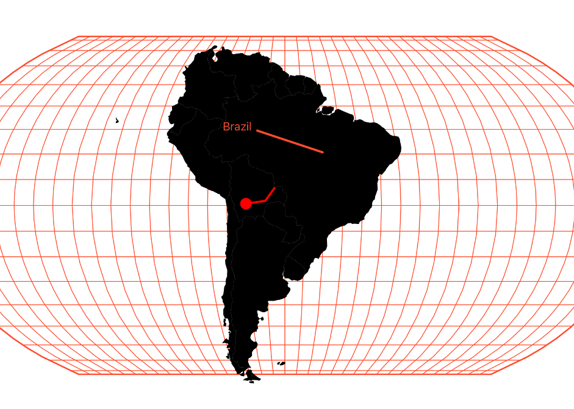

# Rescript React Simple Maps [](https://www.npmjs.com/package/rescript-react-simple-maps)
Rescript bindings for [React Simple Maps](https://github.com/zcreativelabs/react-simple-maps)

## Getting Started
I haven't published on NPM or Yarn yet but you can include it locally.

1. Clone this repo
2. Add this to your `package.json`:
```json
"dependencies": {
    "rescript-react-simple-maps": "file:../rescript-react-simple-maps"
}
```
3. Add this to you `bsconfig.json`:
```json
"bs-dependencies": [
    "@rescript/react",
    "rescript-react-simple-maps"
]
```
4. Import into your Rescript project
```rescript
open RescriptReactSimpleMaps
```

5. Access the `ReactSimpleMaps` module

## Example Usage

```rescript
open RescriptReactSimpleMaps

@react.component
let make = () => {
  open ReactSimpleMaps

  let displayPosition = (pos: position) => {
    Js.log("Your position:")
    Js.log(pos)
  }

  <div>
    <div className="map-container">
      <ComposableMap>
        <ZoomableGroup
          center={(0., 0.)}
          zoom={2.}
          maxZoom={8.}
          minZoom={1.}
          onMoveStart={displayPosition}
        >
          <Graticule stroke="#F53" />
          <Sphere stroke="#FF5533" strokeWidth={2.} />
          {
            geographyTestData
            |> Array.map((geo) => {
              <Geography
                key={geo.rsmKey}
                geography={geo}
                fill={"#000000"}
              />
            })
            |> React.array
          }

          <Marker
            coordinates={(-20.13992755570007, 0.6525543036691559)}
          >
            <circle r={"8"} fill="#ff0000" />
          </Marker>

          <Line
            coordinates={[
              (-20.13992755570007, 0.6525543036691559),
              (-10.13992755570007, 1.7325543036691559),
              (-5.13992755570007, 6.925543036691559)
            ]}

            stroke="#ff0000"
          />

          <Annotation
            subject={(20.13992755570007, 20.6525543036691559)}
            dx={-90.}
            dy={-30.}
            connectorProps={{
              "stroke": "#FF5533",
              "strokeWidth": 3,
              "strokeLinecap": "round"
            }}
          >
            <text x="-8" textAnchor="end" alignmentBaseline="middle" fill="#F53">
              {React.string("Brazil")}
            </text>
          </Annotation>
        </ZoomableGroup>
      </ComposableMap>
    </div>
  </div>
}
```

This snippet of code generates this map:

